# Introduction

Azur Files is an alternative to Windows explorer.

It is a split-pane file manager for Windows that scrolls a folder of a hundred thousand
files at the refresh rate, and — the part Explorer has never done — shows you what is
*inside* a file without leaving the window: source, Markdown, images, video, and a
binary's dependency tree.

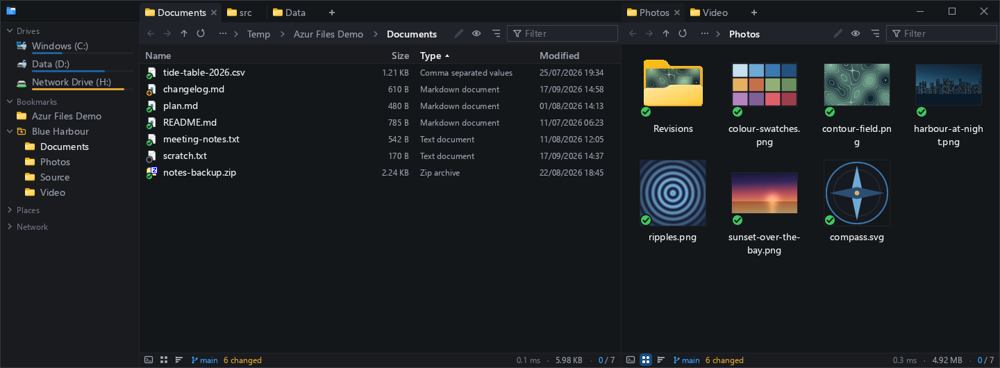

# Features

- **fast** — a folder is read once and never asked about again, so a frame costs what the
  *window* is worth rather than what the folder is. The status line shows the real numbers.
- **flatten folder** — everything under here, as one list or as a tree
- **folder size** — measure the folder you are looking at, with a bar per row
- **filter search** — type, and the listing narrows as you type
- **bookmarks** — the folders you actually use, arrangeable into groups
- **tabs / panels** — tabs per pane, and panes split by dragging a tab to an edge

## Flatten a folder

Everything below the current folder in one listing — as a tree, or as a flat list with each
file's folder beside its name. Nothing is read twice: the flattened view is the same scan the
listing already did.

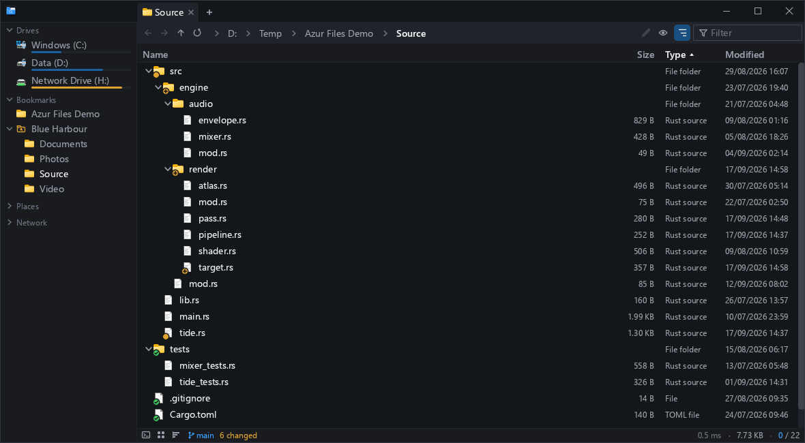

## Folder sizes

Explorer will not tell you how big a folder is without opening its properties one folder at a
time. Press the measure button and every folder on show is counted at once, each row carrying
a bar for its share of the total.

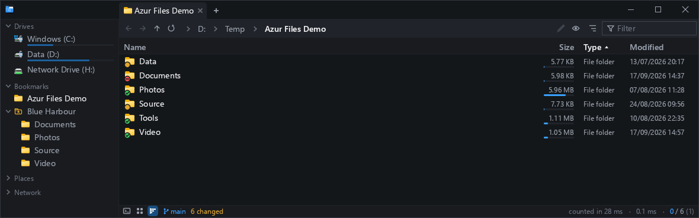

## Filter as you type

The filter box narrows the listing to what matches. Combined with the flatten above it becomes
a search over the whole tree — here, every `.rs` file under a project: 15 rows out of 231,
picked out in 5.8 ms, with no background indexer anywhere.

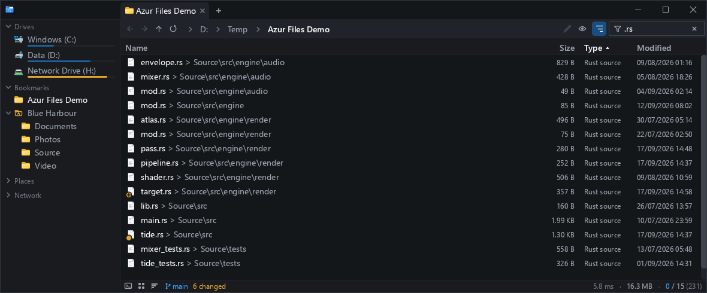

## Preview

Put the keyboard on a file and press **Space** — or `Ctrl+P` — and the panel opens beside the
listing, showing the file itself. It lives *inside* the pane, so two panes side by side each get
their own: comparing two builds of the same DLL is a matter of looking left and right.

`Space` closes it again. Which side it takes — right, bottom, or whichever fits the pane's
shape — is a setting for the window; whether it is open is a fact about each folder, so opening
it here does not open it in the tab beside this one.

### Text

- Text file preview, with line numbers
- Syntax coloration for source files — the language from the extension, or from the first
  couple of characters when the name says nothing
- Markdown rendered as a document, or as its source
- Find within the file, and two or more files side by side
- Diff — see [Git](#git) below, which is where "what did I change here" lives

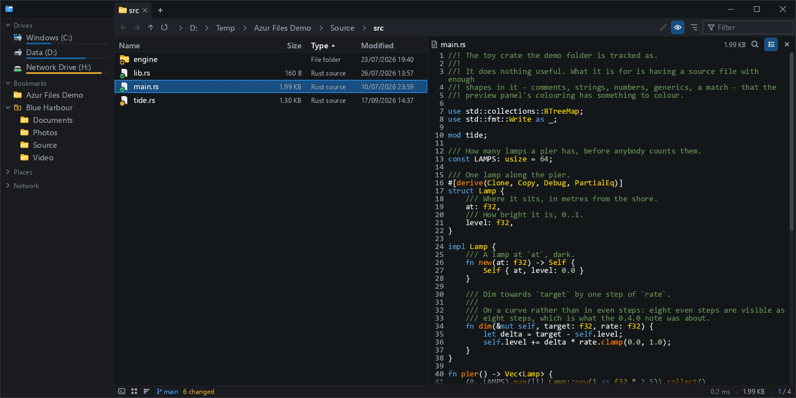

Markdown is rendered rather than shown as text, with a button on the bar to see the markup
instead:

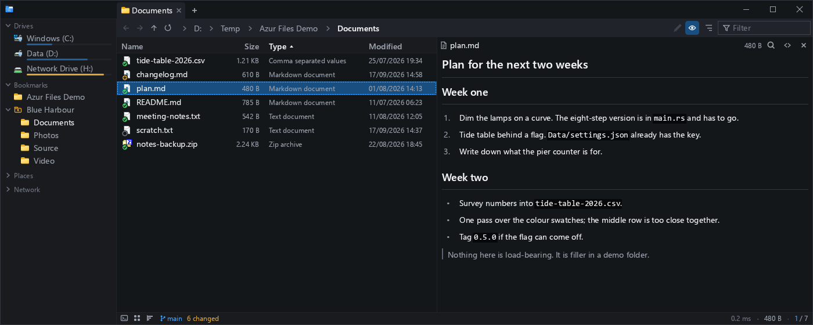

Select more than one file and the panel tiles them, which is how you read two versions of
something side by side:

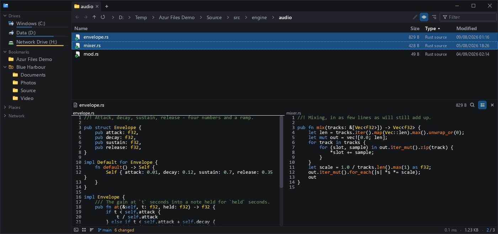

### Picture

- Image preview, zoom and pan
- PNG, JPEG, GIF, BMP, TIFF, WebP, ICO, and SVG rasterised
- Image diff: select two pictures and get the two of them and the difference

A folder that is mostly pictures switches itself to thumbnails; the panel shows the full image
with its dimensions and a zoom control.

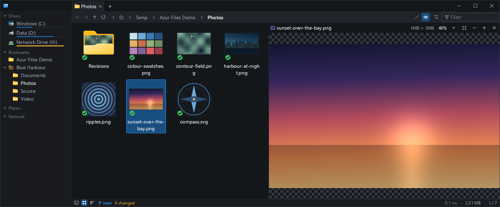

Two pictures selected at once are shown as three: each of them, and a mask of where they
differ, with the share of differing pixels on the bar. The same view answers "what changed in
this image" against the last commit.

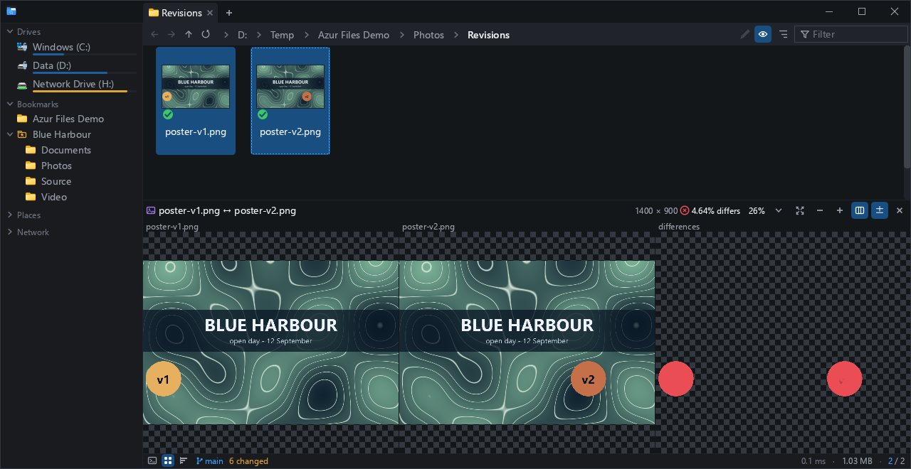

### Video

- video player — play, seek, mute, fullscreen, inside the panel

Windows' own decoders, so whatever plays elsewhere on the machine plays here. The clock, the
sound and the seek bar are the panel's; nothing launches.

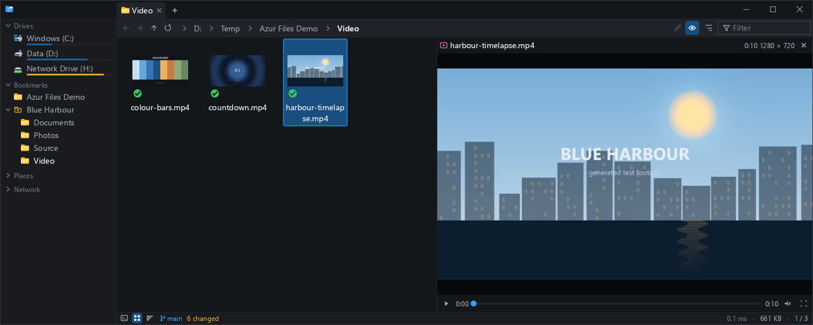

### Binary

- dependencies — what an executable imports, from where, and what is missing

The whole dependency graph for a `.exe` or `.dll`: every module it pulls in, the path each one
actually resolved to, its architecture, and a count of the ones Windows could not find. Fold a
module open to see what *it* depends on, search the graph by name, or flatten it to a plain
list.

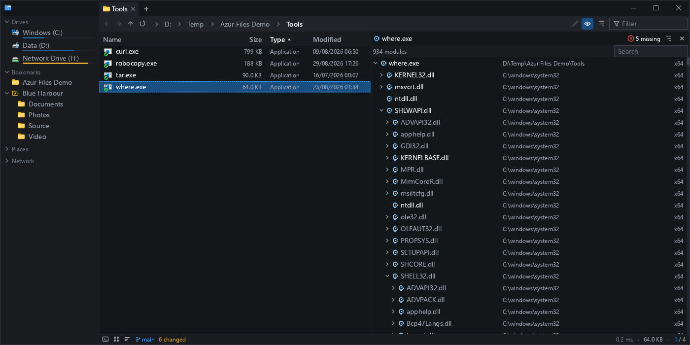

Click a module and two more panels appear below the tree: the symbols this binary imports from
it, and the symbols it exports.

## Console

- basic console support (batch, powershell, bash)
- cwd synchronized with the explorer folder
- output navigation

Not a terminal — a shell on plain pipes, kept alive across commands, with its output collected
in blocks: one per command, foldable, each carrying its exit status, and each walkable with the
keyboard so you can pull one line out of a build log without reaching for the mouse. Which is
the right shape for running a build, a `git status` or a test and reading the answer.

The shell starts in the folder the pane is showing, and it works the other way too: `cd`
somewhere in the console and the pane follows. A prompt hook (optional, one line in your shell
profile) extends that to a *real* terminal outside the window — `cd` there, and the focused pane
goes with it.

`git rebase -i`, `ssh` and anything else that wants a real terminal will not work here, by
design: a pipe is not a terminal, and the alternative was writing a terminal emulator.

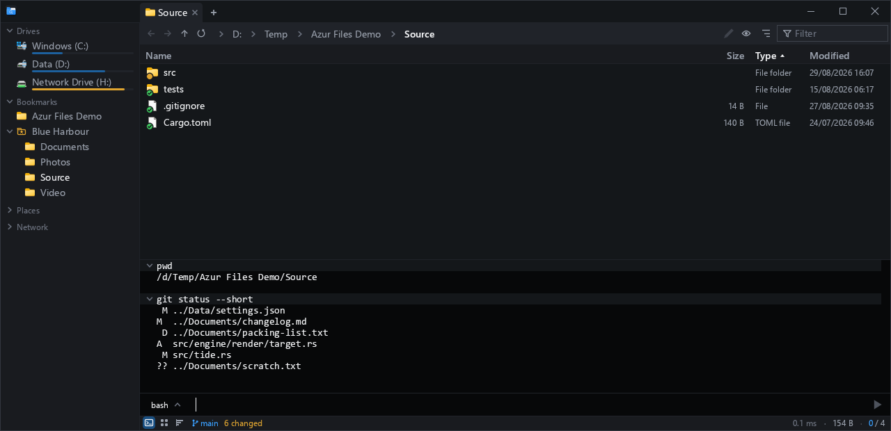

## Git

- changes — every modified, added, deleted and untracked file, in one listing
- git diff — what changed in a file, in the preview panel

Every row in every listing carries git's answer for that file as a badge on its icon: a green
tick for nothing left to do, amber for a change on disk, amber with a plus for a change already
staged, a grey ring for untracked, red for gone or conflicted. A folder wears the most urgent
thing under it.

The filter funnel's **git lens** then throws away everything else and lists only what has
changed, wherever it sits in the tree. The status line carries the branch and the count.

There is no cache: `git` is re-run, because git is the fastest thing that answers this and the
answer is then the same one your own tooling gives.

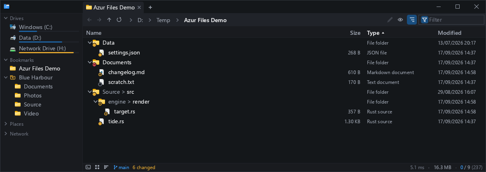

The preview panel's diff view puts the lines a file gained on a green band and the ones it lost
back on a red one, numbered as `HEAD` had them, with long runs of unchanged lines folded away —
and the file's syntax colouring intact.

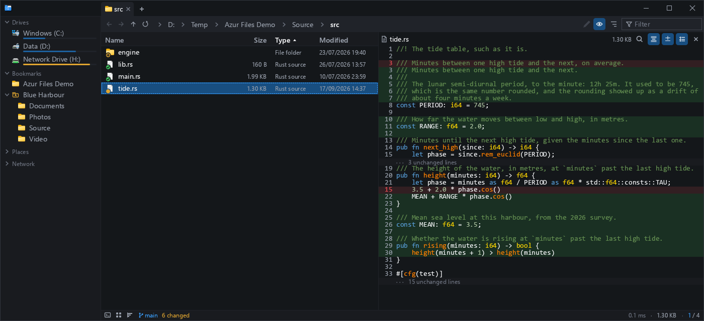
